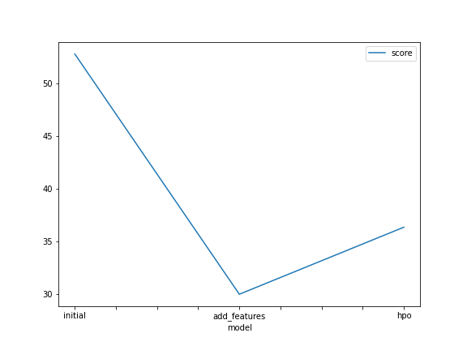
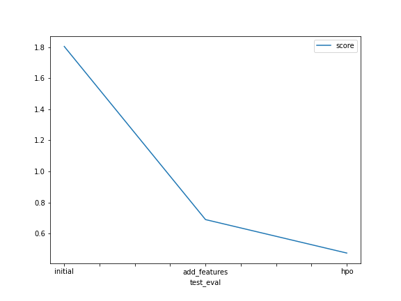

# Report: Predict Bike Sharing Demand with AutoGluon Solution
#### KANCHI TANK

## Initial Training
### What did you realize when you tried to submit your predictions? What changes were needed to the output of the predictor to submit your results?
Initially when I used the raw data, the model did not perform well because of many errors. I had to replace the negative numbers with 0 in order to submit to Kaggle.

### What was the top ranked model that performed?
The WeightedEnsemble_L3 model.

## Exploratory data analysis and feature creation
### What did the exploratory analysis find and how did you add additional features?
I divided the datetime in month, day, year and hour for adding additional features. On top of that, I also transformed the season and weather features to categorical.

### How much better did your model preform after adding additional features and why do you think that is?
I decided to separate the date because it helps the model to analyse seasonality paterns in the data which can be useful for a regression model. Additional features can be good predictors to estimate the target value.

## Hyper parameter tuning
### How much better did your model preform after trying different hyper parameters?
Hyper parameter tuning was useful in some cases but it did not improve the performance of the model much, some configurations where useful but others harmed the model performance.

### If you were given more time with this dataset, where do you think you would spend more time?
I would have done an extensive exploratory data analysis in order to get more insights on this dataset, and I would have done more research about the hyperparameters.

### Create a table with the models you ran, the hyperparameters modified, and the kaggle score.
|model|hpo1|hpo2|hpo3|score|
|--|--|--|--|--|
|initial|default_vals|default_vals|default_vals|1.80386|
|add_features|default_vals|default_vals|default_vals|0.68989|
|hpo|GBM: num_leaves: lower=26, upper=66|NN: dropout_prob: 0.0, 0.5|GBM: num_boost_round: 100|0.47459|

### Create a line plot showing the top model score for the three (or more) training runs during the project.

### Create a line plot showing the top kaggle score for the three (or more) prediction submissions during the project.

## Summary
In this project, I was able to apply all the concepts that were covered in this unit of the course. I used the skills that I gained and was able to develop a machine learning regression model by using the AutoGluon framework. I enjoyed this project as I gained a lot of knowledge and a good Kaggle score!
